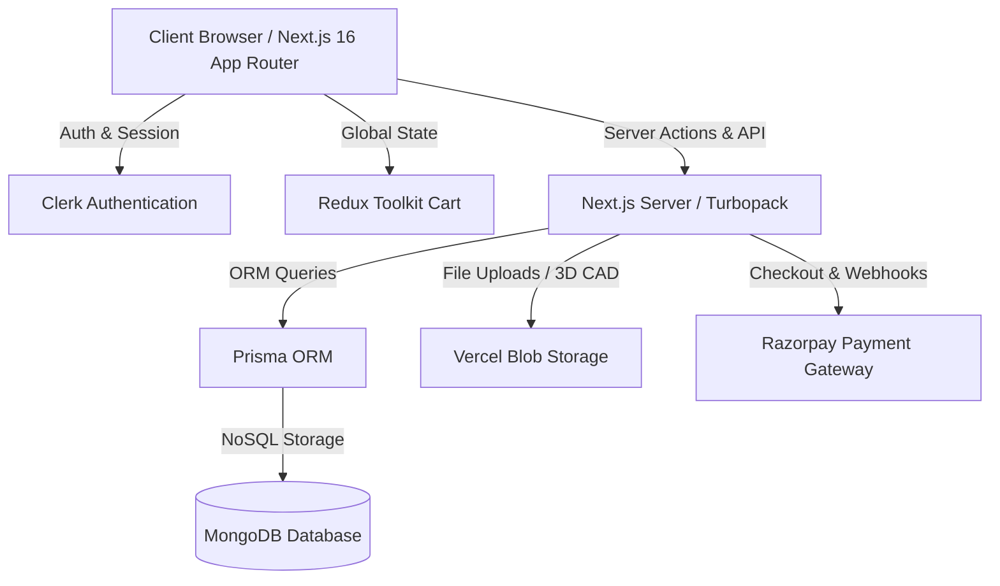

# AeroForge Labs ⚡
### Next-Gen E-Commerce & Rapid Prototyping Platform for Drones, Aeronautics & 3D Manufacturing


**🌐 Live Demo:** [aeroforge-labs.vercel.app](https://aeroforge-labs.vercel.app/)  
**📁 GitHub Repo:** [github.com/Vaibhav-Singh2/aeroforge-ecommerce](https://github.com/Vaibhav-Singh2/aeroforge-ecommerce)

---

## 🚀 Overview

**AeroForge Labs** is an enterprise-grade, full-stack e-commerce and on-demand rapid prototyping platform built with **Next.js 16 (App Router & Server Actions)**, **React 19**, and **Prisma ORM with MongoDB**.

Beyond traditional e-commerce capabilities, AeroForge Labs features an **interactive on-demand 3D printing pipeline** (with CAD file uploads to Vercel Blob storage) and a **hardware diagnostics & repair booking engine** for custom electronics and aeronautics equipment.

---

## 🌟 Key Features

### 🛒 1. Advanced E-Commerce Storefront
- **Dynamic Multi-Variant Catalog**: Filter by category (Ready-to-fly Drones, RC Airplanes, Avionics, Replacement Parts).
- **Attribute & SKU Engine**: Support for multiple product variants, technical specification sheets, weight tracking, and real-time inventory management.
- **Faceted Search & Filtering**: Instant client-side & server-filtered queries.
- **Redux-Powered Cart**: Persistent, hydrated cart state with real-time stock limits and price calculation.

### 🖨️ 2. On-Demand 3D Printing Pipeline
- **CAD/3D File Upload**: Direct multi-part model upload (.STL, .OBJ, .STEP) powered by Vercel Blob cloud storage.
- **Interactive Print Configurator**: Custom parameter controls for material selection (PLA, ABS, PETG, TPU, Carbon Fiber), infill density, layer resolution, and color finishes.
- **Automated Cost Estimation**: Dynamic algorithmic pricing based on material volume, print time, and density parameters.

### 🔧 3. Hardware Diagnostics & Repair Booking
- **Custom Service Tickets**: Users can submit repair requests for crashed drones, burned ESCs, avionics calibration, and motor replacements.
- **Photo Diagnostic Upload**: Multi-image attachments for visual fault inspection.
- **State-Machine Lifecycle Tracking**: Real-time status progression (`PENDING_REVIEW` ➔ `RECEIVED` ➔ `IN_PROGRESS` ➔ `TESTING` ➔ `COMPLETED` ➔ `RETURNED`).

### 💳 4. Secure Checkout & Payment Processing
- **Razorpay Payment Gateway**: Seamless modal checkout flow with INR currency processing.
- **Cryptographic Webhook Verification**: HMAC-SHA256 signature verification ensuring zero payment tampering.
- **Resilient Order Transitions**: Automatic state updates from `PENDING` to `PAID` with automated order confirmation.

### 👤 5. User Account & Admin Dashboards
- **Customer Control Center**: Manage saved shipping addresses, active orders, print jobs, and repair tickets.
- **Authentication**: Powered by Clerk with custom Prisma user synchronization and role-based access control (RBAC).
- **Admin Control Panel**: Backoffice view to manage products, categories, stock, order statuses, and service pipelines.

---

## 🏗️ System Architecture



---

## 🛠️ Tech Stack

| Domain | Technology |
| :--- | :--- |
| **Framework** | Next.js 16 (App Router, Server Actions, Turbopack) |
| **Frontend** | React 19, TypeScript, Tailwind CSS v4, Radix UI |
| **State Management** | Redux Toolkit (`@reduxjs/toolkit`, `react-redux`) |
| **Database & ORM** | MongoDB + Prisma ORM (`@prisma/client`) |
| **Authentication** | Clerk Auth (`@clerk/nextjs`) + RBAC |
| **Payments** | Razorpay Node SDK + Webhook Verification |
| **Cloud Storage** | `@vercel/blob` for 3D models and diagnostic images |
| **Form & Validation**| React Hook Form + Zod (`@hookform/resolvers`, `zod`) |
| **UI Notifications**| Sonner Toast Notifications & Lucide Icons |

---

## 💻 Quick Start & Local Setup

### 1. Clone the Repository
```bash
git clone https://github.com/Vaibhav-Singh2/aeroforge-ecommerce.git
cd aeroforge-ecommerce
```

### 2. Install Dependencies
```bash
npm install
```

### 3. Configure Environment Variables
Create a `.env` file in the root directory:
```env
# Database
DATABASE_URL="mongodb+srv://<username>:<password>@cluster.mongodb.net/aeroforge?retryWrites=true&w=majority"

# Clerk Authentication
NEXT_PUBLIC_CLERK_PUBLISHABLE_KEY=pk_test_...
CLERK_SECRET_KEY=sk_test_...
NEXT_PUBLIC_CLERK_SIGN_IN_URL=/sign-in
NEXT_PUBLIC_CLERK_SIGN_UP_URL=/sign-up

# Razorpay Payments
RAZORPAY_KEY_ID=rzp_test_...
RAZORPAY_KEY_SECRET=...
RAZORPAY_WEBHOOK_SECRET=...

# Vercel Blob Storage
BLOB_READ_WRITE_TOKEN=vercel_blob_rw_...

# Default Admin Setup
DEFAULT_ADMIN_EMAIL="admin@aeroforge.dev"
DEFAULT_ADMIN_PASSWORD="admin_secure_password"
```

### 4. Database Setup & Seeding
Generate the Prisma Client and seed the database with catalog products, categories, and demo data:
```bash
npx prisma generate
npx prisma db push
npx tsx prisma/seed.ts
```

### 5. Run Development Server
```bash
npm run dev
```
Open [http://localhost:3000](http://localhost:3000) in your browser.

---

## 🔑 Demo & Test Credentials (For Recruiters)

| Role | Email | Password | Access Level |
| :--- | :--- | :--- | :--- |
| **Administrator** | `admin@aeroforge.dev` | `admin123` | Full Admin Panel, Catalog & Order Management |
| **Test Customer** | Sign up with any email or test OAuth via Clerk | User Dashboard, Cart, 3D Print & Repair Orders |

---

## 🎯 Engineering Highlights & Resume Talking Points

- **Next.js 16 Turbopack & React 19 Server Components**: Maximized SEO and performance through hybrid server-side rendering and streaming server components.
- **Robust Multi-Tenant Data Schema**: Engineered a scalable schema supporting product variants, dynamic technical specification payloads (JSON), and polygon model metadata.
- **Zero-Trust Payment Integration**: Built webhook processing with signature verification and idempotency checks to prevent duplicate transactions.
- **Optimized Asset Pipeline**: Streamlined CAD model and high-res photo uploads directly to edge storage via signed token authentication.

---

## 👨‍💻 Author

**Vaibhav Singh**
- **GitHub**: [@Vaibhav-Singh2](https://github.com/Vaibhav-Singh2)
- **Email**: [vaibhav.fullstack.dev@gmail.com](mailto:vaibhav.fullstack.dev@gmail.com)

---

## 📄 License
This project is licensed under the MIT License - feel free to explore, fork, and build upon it!
